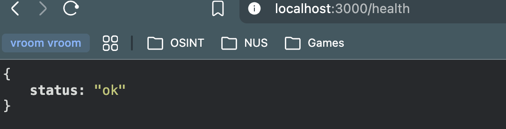

# Synthetic Forensic Scenario Generator

This is a small local REST API that generates deterministic digital-forensics scenarios. It currently supports one scenario type, `credential_theft`.

Every generated scenario contains users, devices, and events representing this attack chain:

```text
  -> Authentication or initial access
  -> Process execution
  -> Credential access
  -> Network connection
  -> Data exfiltration
```

The project uses Node.js, Express, Sequelize, and SQLite. It runs locally and does not require paid services, API keys, or a separate database server.

## 1. Prerequisites and installation

Requirements:

- Node.js 20 or newer
- npm

On macOS, native build tools can be installed with:

```bash
xcode-select --install
```

Install the dependencies from the project directory:

```bash
npm ci
```

You can use `npm install` instead if you are updating dependencies.

The main packages are:

- Express for the API
- Sequelize for models, validation, relationships, and transactions (Object Relational Mapping)
- SQLite for local persistence (Database)
- Supertest for API integration tests

## 2. Running the service locally

Start the server in watch mode:

```bash
npm run dev
```

You can also run it normally:

```bash
node index.js
```

The server uses port 3000 by default:

To use another port:

```bash
PORT=4000 node index.js
```

When the server starts, Sequelize connects to SQLite and creates any missing tables. The database is saved as `scenarios.sqlite` in the project directory.

## 3. Running the tests

Run all automated tests with:

```bash
npm test
```

The tests use an in-memory SQLite database, so they do not modify your normal `scenarios.sqlite` file. You also do not need to start the server separately before running them.

The tests cover:

- deterministic generation with a fixed seed
- requested users, devices, and event counts
- unique IDs and valid references
- timestamp and attack-chain ordering
- deliberately corrupted scenarios
- successful asynchronous API generation
- invalid configurations and malformed JSON
- unknown scenarios
- completed scenario retrieval
- scenario validation and individual-event retrieval

There are also a few `test.todo()` cases left for future improvements. They are shown as TODOs and are not counted as failures.

## 4. API endpoints

All request and response bodies uses JSON format. For all the GET requests, you can simply use your browser and input the desire url. (e.g.)




### Health check

```http
GET /health
```

Example:

```bash
curl -i http://localhost:3000/health
```

Response: `200 OK`

```json
{
  "status": "ok"
}
```

### Create a scenario

```http
POST /api/scenarios
Content-Type: application/json
```

Configuration:

| Field | Type | Validation |
| --- | --- | --- |
| `scenario` | string | Must be `credential_theft` |
| `users` | integer | From 1 to 100 |
| `devices` | integer | From 1 to 100 |
| `events` | integer | From 5 to 10,000 |
| `seed` | integer | Must be a JavaScript safe integer |

`events` is the total event count. This includes the five required attack events and any background events.

Example request:

```bash
curl -i \
  -X POST http://localhost:3000/api/scenarios \
  -H "Content-Type: application/json" \
  -d '{
    "scenario": "credential_theft",
    "users": 2,
    "devices": 2,
    "events": 25,
    "seed": 42
  }'
```

Response: `202 Accepted`

```http
Location: /api/scenarios/scenario-550e8400-e29b-41d4-a716-446655440000
```

```json
{
  "id": "scenario-550e8400-e29b-41d4-a716-446655440000",
  "status": "pending"
}
```

The job ID is allowed to be random. It is operational metadata and is not part of the deterministic scenario content.

### Get a scenario

```http
GET /api/scenarios/{id}
```

While generation is still running:

```json
{
  "id": "scenario-550e8400-e29b-41d4-a716-446655440000",
  "status": "running"
}
```

Once completed, the response includes the generated content. This example is shortened:

```json
{
  "id": "scenario-550e8400-e29b-41d4-a716-446655440000",
  "status": "completed",
  "scenario": {
    "metadata": {
      "scenario": "credential_theft",
      "seed": 42,
      "timeline_start": "2025-08-17T00:45:00.000Z"
    },
    "ground_truth": {
      "attack_chain": [
        {
          "sequence": 1,
          "stage": "authentication_or_initial_access",
          "event_type": "authentication",
          "event_id": "event-001"
        }
      ]
    },
    "users": [
      {
        "id": "user-001",
        "username": "riley001",
        "role": "administrator"
      }
    ],
    "devices": [
      {
        "id": "device-001",
        "hostname": "WORKSTATION-001",
        "os": "Windows",
        "assigned_user_id": "user-001"
      }
    ],
    "events": [
      {
        "id": "event-001",
        "type": "authentication",
        "timestamp": "2025-08-17T00:45:00.000Z",
        "actor_user_id": "user-001",
        "device_id": "device-001",
        "details": {
          "result": "success",
          "attack_stage": "authentication_or_initial_access",
          "attack_sequence": 1
        }
      }
    ]
  }
}
```

If generation fails, the response has `status: "failed"` and a `generation_error` object.

### Validate a completed scenario

```http
POST /api/scenarios/{id}/validate
```

This reloads the stored scenario and runs the independent invariant validator on it.

Valid response: `200 OK`

```json
{
  "id": "scenario-550e8400-e29b-41d4-a716-446655440000",
  "status": "completed",
  "valid": true,
  "errors": []
}
```

If the stored scenario is invalid, the request still returns `200 OK` because validation itself worked:

```json
{
  "id": "scenario-550e8400-e29b-41d4-a716-446655440000",
  "status": "completed",
  "valid": false,
  "errors": [
    {
      "code": "event_count_mismatch",
      "message": "Expected 25 events but generated 24"
    }
  ]
}
```

Pending, running, or failed scenarios return `409 Conflict` because there is no completed content to validate.

### Retrieve one event

```http
GET /api/scenarios/{id}/events?event={eventId}
```

Example:

```bash
curl "http://localhost:3000/api/scenarios/scenario-550e8400-e29b-41d4-a716-446655440000/events?event=event-003"
```

Response: `200 OK`

```json
{
  "scenario_id": "scenario-550e8400-e29b-41d4-a716-446655440000",
  "event": {
    "id": "event-003",
    "type": "credential_access",
    "timestamp": "2025-08-17T00:53:00.000Z",
    "actor_user_id": "user-001",
    "device_id": "device-001",
    "details": {
      "method": "browser_credential_store",
      "attack_stage": "credential_access",
      "attack_sequence": 3
    }
  }
}
```

This endpoint returns:

- `400` if the `event` query parameter is missing
- `404` if the scenario or event does not exist
- `409` if the scenario is not completed

### Error responses

Errors contain a machine-readable `error` and a human-readable `message`. Configuration errors can also include a `details` array.

Invalid configuration: `400 Bad Request`

```json
{
  "error": "invalid_configuration",
  "message": "The scenario configuration is invalid",
  "details": [
    {
      "field": "requestedEvents",
      "message": "Validation min on requestedEvents failed"
    }
  ]
}
```

Malformed JSON: `400 Bad Request`

```json
{
  "error": "malformed_json",
  "message": "Request body contains invalid JSON"
}
```

Unknown scenario: `404 Not Found`

```json
{
  "error": "scenario_not_found",
  "message": "Scenario does-not-exist was not found"
}
```

Unexpected failures return `500 Internal Server Error`. Stack traces are not sent to the client.

## 5. Data model

The SQLite database has four Sequelize models.

### Scenario

This stores the job and requested configuration:

- `id`: random scenario job ID and primary key
- `scenarioType`
- `requestedUsers`
- `requestedDevices`
- `requestedEvents`
- `seed`
- `status`: `pending`, `running`, `completed`, or `failed`
- `errorMessage`
- `createdAt` and `updatedAt`

### User

- `internalId`: auto-incrementing database key
- `entityId`: deterministic public ID (e.g.) `user-001`
- `username`
- `role`: `employee`, `administrator`, or `contractor`
- `scenarioId`: foreign key to Scenario

### Device

- `internalId`: auto-incrementing database key
- `entityId`: deterministic public ID (e.g.) `device-001`
- `hostname`
- `os`: `Windows`, `Linux`, or `macOS`
- `scenarioId`: foreign key to Scenario
- `assignedUserInternalId`: foreign key to User

### Event

- `internalId`: auto-incrementing database key
- `entityId`: deterministic public ID (e.g.) `event-001`
- `type`
- `timestamp`
- `details`: JSON containing event context and optional ground-truth markers
- `scenarioId`: foreign key to Scenario
- `actorUserInternalId`: foreign key to User
- `deviceInternalId`: foreign key to Device

The public IDs only need to be unique inside one scenario. Two scenarios created from the same seed can both contain `user-001`, so separate internal database keys are used for relationships. It is easier for reference by having an event be labelled in order within a Scenario.

## 6. Deterministic generation

The generator is separate from the API endpoint logic and Object Models. It receives a validated configuration and returns generated content without reading the database or current system time.

It stays deterministic by:

1. turning the seed into a 32-bit pseudo-random generator state;
2. using that generator for every generated choice instead of `Math.random()`;
3. building IDs from array positions;
4. starting from a fixed UTC date plus a seeded time offset;
5. increasing timestamps using seeded minute intervals;

The same configuration and seed therefore produce equivalent users, devices, events, timestamps, details, and ground truth.

The job ID and Sequelize's `createdAt` and `updatedAt` values are intentionally non-deterministic. They are operational fields and are not part of the generated scenario.

The intended attack events contain `attack_stage` and `attack_sequence`. The ground-truth object maps those stages to event IDs. It works like an answer key when testing another forensic-analysis workflow.

## 7. Asynchronous generation

`POST /api/scenarios` first inserts a `pending` Scenario row and returns `202 Accepted`. It then schedules generation with `setImmediate()`, so the HTTP request does not wait for the scenario to finish.

The background operation:

1. changes the job to `running`;
2. runs the deterministic generator;
3. validates the generated scenario independently;
4. saves users, devices, and events in one SQLite transaction;
5. changes the job to `completed` in that transaction.

If generation, validation, or persistence fails, the job is changed to `failed` and the error message is stored. The transaction prevents partial generated data from being committed.

`setImmediate()` schedules the work for later, but it still runs in the Express process. It is not a separate worker or durable queue.

## 8. Storage choice and limitations

I picked SQLite because it gives local file persistence, transactions, and relational constraints without requiring another database server. Sequelize gives a model and validation style that is fairly similar to Mongoose.

The `scenarios.sqlite` file survives application restarts. During tests, the connection changes to SQLite's `:memory:` mode for speed and isolation.

Current storage limitations:

- SQLite has limited concurrent writes compared with a client-server database.
- The project is meant to run as one local application process.
- Old scenarios are never deleted automatically.
- There are no formal database migrations yet. Startup only calls `sequelize.sync()`.
- The application does not encrypt the database file.
- Backup and corruption recovery are not automated.

## 9. Important design decisions and trade-offs

### SQLite and Sequelize instead of Mongoose

I first considered Mongoose because I was already comfortable with its schema syntax from Full Stack Open. The problem was that Mongoose still needs a running MongoDB server. I also considered Zod and Yup, but they only solve validation and do not store anything. Sequelize with SQLite gave me model validation and local persistence in one setup.

### Separate generator and validator

Generation and validation are separate modules. This lets the tests deliberately modify a valid generated scenario and check that the validator catches the problem. The validator is not just testing the same code path used to generate the data.

### Separate database tables

Users, devices, and events are stored in separate tables instead of one large JSON object. This gives proper relationships, unique constraints, and individual-event lookup. The trade-off is extra mapping code between public deterministic IDs and internal database IDs.

### Attack events come first

The required attack events currently take the first five chronological positions. Remaining events are background authentication, process, or network events. This is easy to understand and validate, but less realistic than mixing attack events throughout the background timeline.

### Ground truth is stored in event details

Attack events store their ground-truth stage and sequence in the existing JSON details field. The API uses those markers to rebuild the top-level ground-truth response after reading from SQLite. This avoids another table, but it also exposes the answer key to normal API users.

### One-event retrieval instead of pagination

The main scenario endpoint still returns the whole completed scenario. I added a smaller endpoint that retrieves one event by ID. I chose this instead of full pagination to keep the optional feature focused and easy to explain.

## 10. Known limitations and production improvements

Known limitations:

- Only `credential_theft` is supported.
- The attack chain cannot be configured.
- The background event choices are limited.
- Generation is fast, so clients may not always observe the `running` state. This makes it a bit difficult to validate whether `running` state exists or not.
- There is no authentication, authorization, or rate limiting. It is just an API.
- Logging via console, logs are not saved anywhere.

Future improvements:

- add retries, concurrency limits, and recovery for abandoned jobs;
- add pagination for large event collections;
- add authentication, authorization, rate limiting, and explicit request-size limits;
- add structured logging;
- support more incident types and configurable attack chains;

## 11. Final Words
Thank you very much for providing me with this opportunity to see the intersection between DF and engineering :D I really enjoyed the development process!